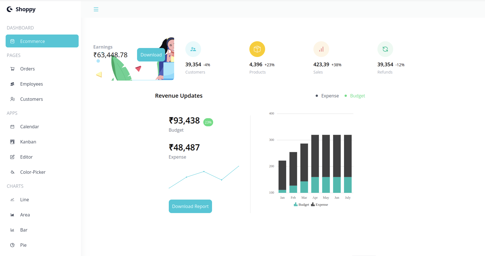
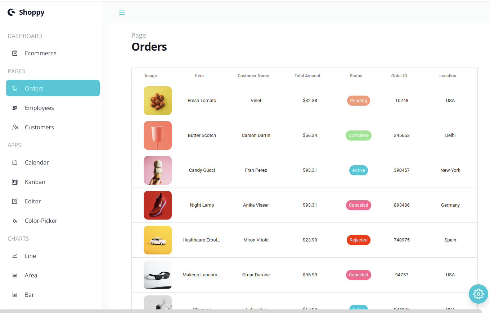
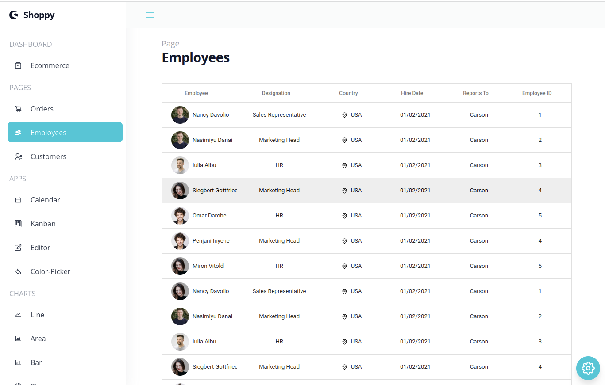
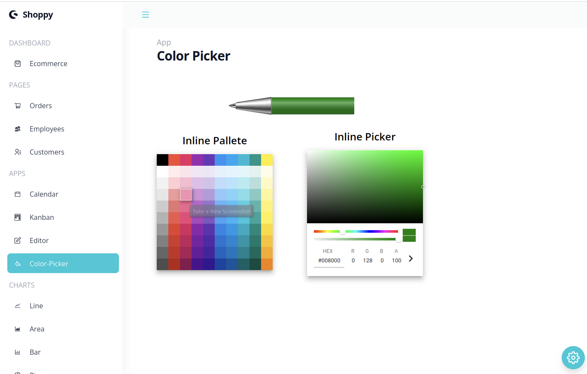
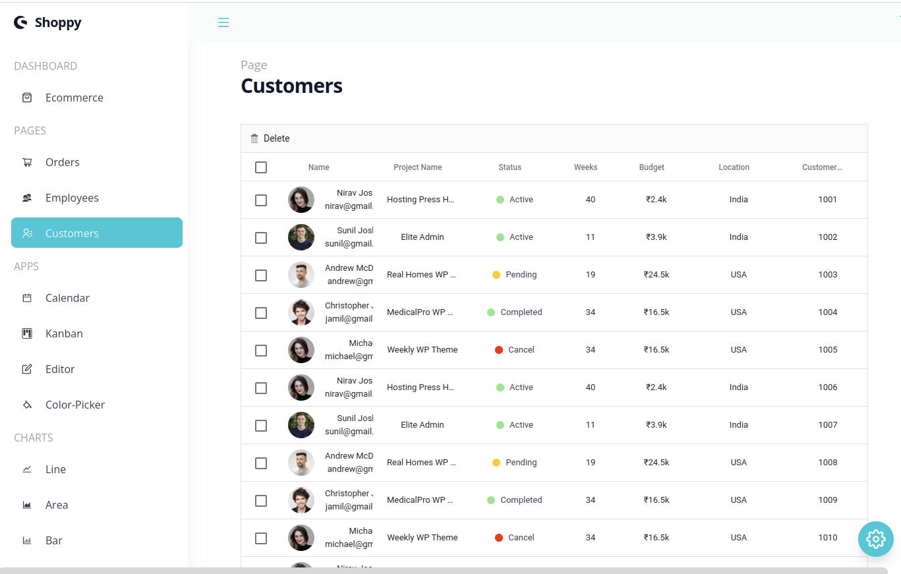
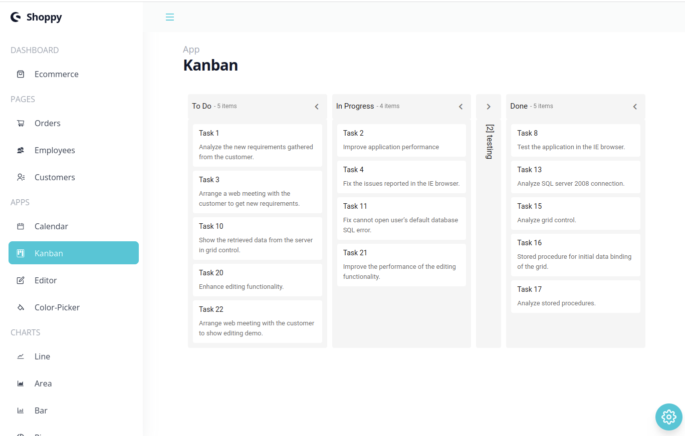
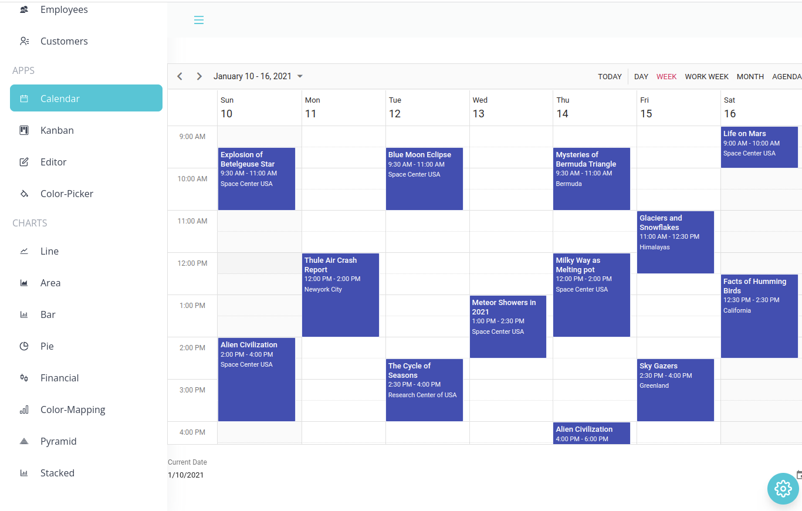

## Using React with Syncfunction created an Admin Dashboard application.

##### Consists of Orders page, Employee details page, Calendar, Kanban, Charts and more.
##### Employee and Customer details manipulation using CRUD features.
##### Dark and Light theme with color picker tool, to use application in desired color.

<a href="https://shoppy-admin-dash.netlify.app/">Check out the app here</a> 

